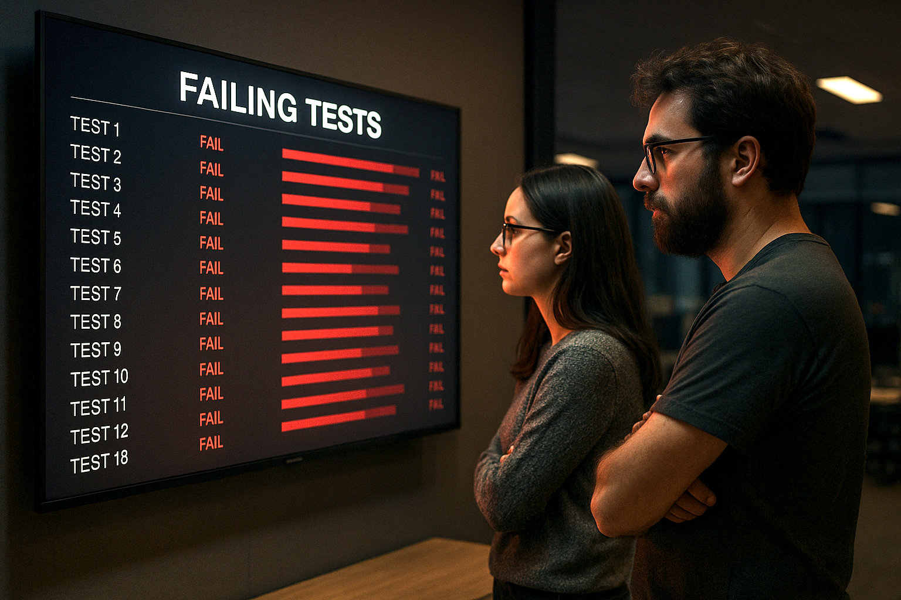

# Parasight 👁️ 

> _AI-Powered UI Testing That Adapts When Your UI Changes_

> **Implementation Details:** For a deep dive into how we built this and the problems it solves, read our article:  
> [Beyond Brittle: Building Resilient UI Testing with AI](https://medium.com/@pkalkman)



[](https://www.python.org/downloads/)
[](https://openai.com)
[](https://playwright.dev)
[](https://makeapullrequest.com)

Parasight is an intelligent UI testing framework that combines Playwright, OmniParser, and the OpenAI Agents SDK to create self-healing tests. Unlike traditional UI tests with brittle selectors, Parasight visually understands your application and adapts to changes automatically - no more 3AM Slack alerts when someone moves a button!

## Features

- 🪄 **No Hard-Coded Selectors**: Uses visual analysis instead of brittle CSS selectors
- 🧠 **AI-Powered Testing**: Leverages GPT models to understand UI context and interactions
- 🔄 **Self-Healing**: Automatically adapts when UI elements move or change
- 👁️ **Visual Understanding**: Uses OmniParser to analyze and map UI elements
- 🎭 **Playwright Integration**: Reliable browser automation under the hood
- 🔍 **Detailed Tracing**: OpenAI's trace visualization shows exactly what your tests are doing

## Installation

### Prerequisites

- Python 3.12 or higher
- An OpenAI API key with access to GPT-4o-mini or similar models
- OmniParser running as a local service (see setup instructions below)

### Install from source

```bash
# Clone the repository
git clone https://github.com/PatrickKalkman/parasight.git
cd parasight

# Create and activate a virtual environment
python -m venv venv
source venv/bin/activate  # On Windows: venv\Scripts\activate

# Install the package and dependencies
pip install -e .
```

### Environment Setup

Create a `.env` file in the project root:

```
OPENAI_API_KEY=your_api_key_here
```

## OmniParser Setup

OmniParser is the vision system that powers Parasight. To set it up:

```bash
# Pull and run the Docker image
docker pull lladyd/omniparser:latest
docker run -p 7860:7860 --gpus all lladyd/omniparser:latest

# Verify it's running
curl http://localhost:7860/health
```

For detailed setup instructions and CPU-only options, see the [OmniParser Setup Guide](docs/omniparser_setup.md).

## Usage

### Running Your First Test

Create a simple login test:

```python
from parasight import UITestAgent

# Define your test case
test_spec = {
    "url": "https://your-app.com/login",
    "credentials": {
        "username": "test_user",
        "password": "password123"
    },
    "success_criteria": "Welcome back"
}

# Run the test
result = UITestAgent().run_test(test_spec)
print(f"Test result: {result}")  # PASS or FAIL
```

### Using the CLI

Run tests from the command line:

```bash
# Run a single test
parasight test --url https://your-app.com/login --username test_user --password password123 --success "Welcome back"

# Run tests from a YAML file
parasight test-suite tests/login_suite.yaml
```

## How It Works

Here's the magic behind Parasight:

1. **Screenshot Capture**: Playwright navigates to your app and takes a screenshot
2. **Visual Analysis**: OmniParser analyzes the screenshot to identify UI elements
3. **AI Planning**: The OpenAI Agent determines what actions to take based on the test goals
4. **Coordinate-Based Interaction**: Instead of selectors, Parasight uses normalized coordinates to interact with elements
5. **Result Verification**: Another screenshot is taken and analyzed to verify the expected outcome

This approach means your tests keep working even when:
- Someone changes a CSS class or ID
- Elements move to different positions
- The DOM structure changes
- New UI frameworks are adopted

## Project Structure

```
parasight/
├── __init__.py
├── main.py                  # Main entry point and agent setup
├── helpers/                 # Helper utilities
│   ├── __init__.py
│   └── omni_parser_client.py
└── special_tools/           # Agent tools
    ├── __init__.py
    ├── take_screenshot_tool.py
    ├── analyze_image_with_omniparser_tool.py
    ├── interact_with_element_tool.py
    ├── validate_element_exists_tool.py
    └── omniparser_models.py
```

## Debugging with Traces

One of the most powerful features of Parasight is the built-in tracing from OpenAI's Agents SDK:

```python
from agents import trace

with trace("Login Test"):
    result = agent.run("Test the login flow...")
```

This creates a detailed visual trace in the OpenAI console showing every step of your test execution, making debugging a breeze.

## Limitations & Roadmap

Current limitations:
- Only supports basic login flows in the prototype
- Requires stable test environment for reliable results
- OmniParser needs a beefy GPU for optimal performance

Coming soon:
- [ ] Test suite definition language
- [ ] Parallel test execution
- [ ] Structured test results and reporting
- [ ] Support for more complex workflows
- [ ] Local LLM support (Llama)

## Contributing

Contributions are welcome! Here's how you can help:

- Try it out and report issues
- Suggest improvements to the agent prompts
- Add support for more complex UI interactions
- Help optimize OmniParser performance
- Improve documentation

## License

[MIT](LICENSE)
